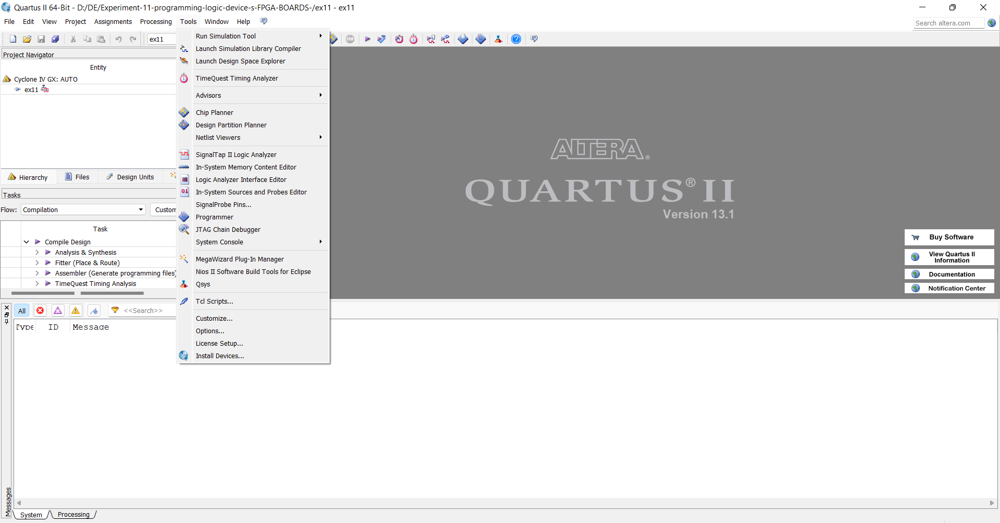
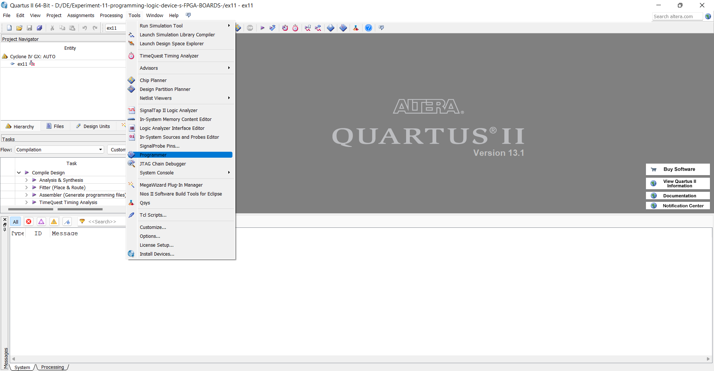
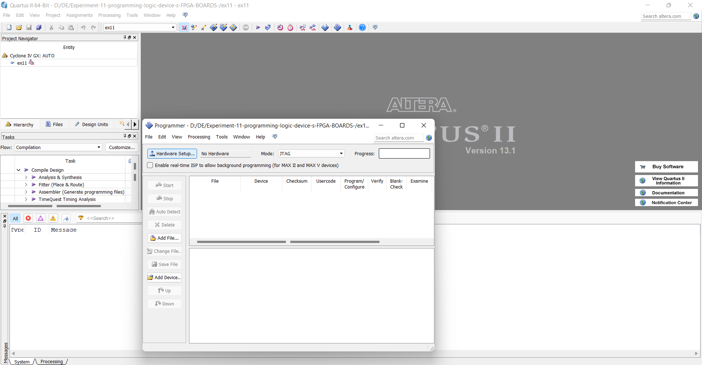
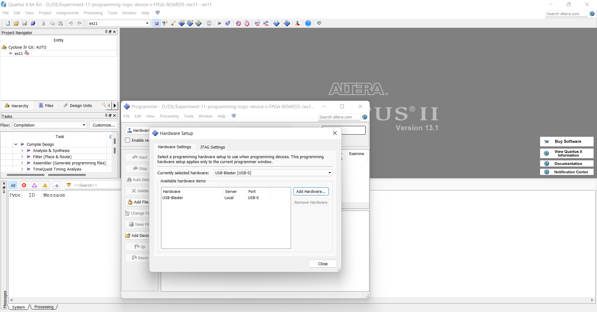
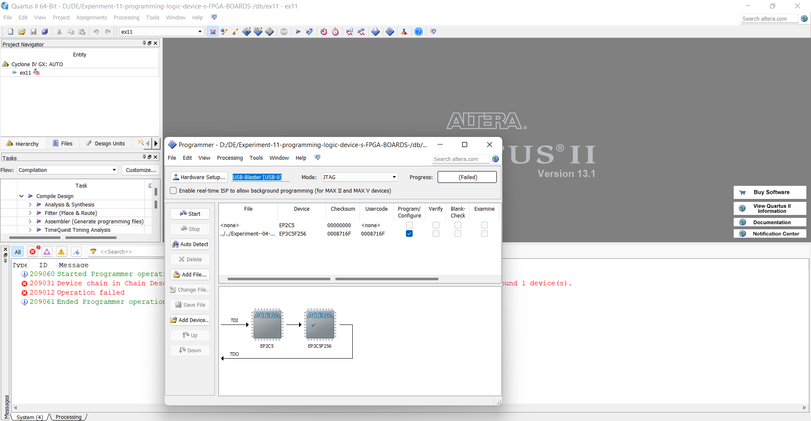
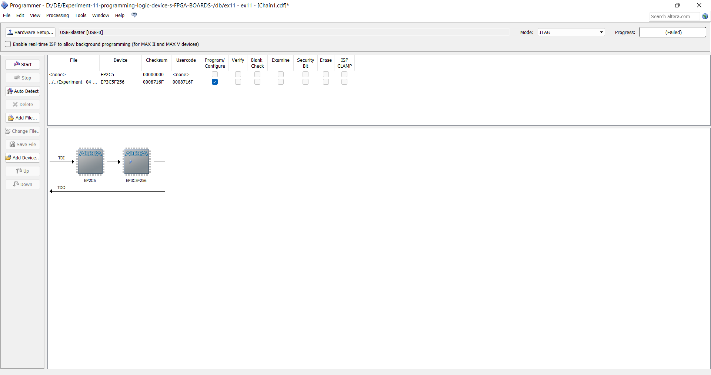
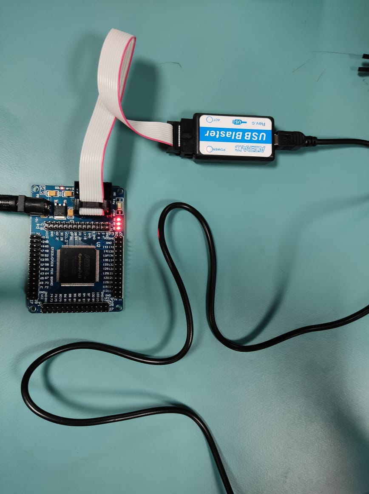

# Experiment 11 programming logic device s FPGA BOARDS
## AIM: 
To understand the standard procedure to interface an FPGA board and flashing method using usb blaster 
## HARDWARE REQUIRED:  
PC, Cyclone II , USB flasher
## SOFTWARE REQUIRED:   
Quartus prime
## THEORY 
A programmable logic device (PLD) is an electronic component used to build reconfigurable digital circuits.
## Procedure 
### STEP2:
Start the Quartus II Programmer.

### STEP2:
Click Add File and select the path to the desired .sof.

### STEP3:
Turn on the Program/Configure option for the added file.

### STEP4:
Click Start to download the selected file to the FPGA. Configuration is complete when the progress bar reaches 100%.

## OUTPUT

## RESULT 
The standard procedure to interface an FPGA board and flashing method using usb blaster has been understod.
